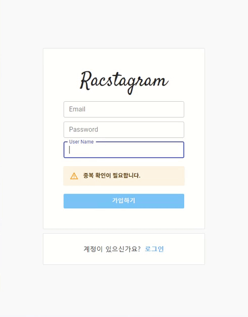

> # 리팩토링 Instagram 클론 프로젝트 by Redux-toolkit33

<br/>

<p align="center">

</p>

<br/>

> # 📄 프로젝트 설명

<br/>

이 프로젝트는 기존에 React & firebase를 통해서 만든 인스타그램 클론 프로젝트 리팩토링 프로젝트 입니다. (해당 프로젝트는 프로젝트 카테고리에서 확인 가능합니다.)

<br/>

## 상태 관리

해당 프로젝트에서는 `redux-toolkit(Slice 모델)`을 사용하여 상태관리를 구현하고 있습니다.

<br/>

## 스타일

현재 SCSS를 채택하여 css 작업을 진행중에 있으며, 부분적으로 Material UI를 사용하고 있습니다.
대부분의 경우에는, Material UI와 React 호환성 문제로 대부분은 SCSS로 직접 구현하고 있습니다.

<br/>
<br/>
<br/>

# 💻 화면 개요

<br/>

체크는 현재 기능적으로 구현된 상황을 의미합니다.

<br/>

- [x] `로딩 화면 또는 Component` : 앱 실행 초기화 작업시 로딩 또는 다른 작업시 사용할 로딩 화면 및 Component
  - [x] 스타일링 완료

<br/>

- [x] `로그인 화면` : 기본 Email 로그인, Social 로그인, 로그인 에러
  - [x] `Email 로그인` : Email, Password input, 로그인 버튼
  - [x] `Social 로그인` : google로그인 버튼, github로그인 버튼
  - [x] `로그인 에러` : Email로그인, google로그인, github 로그인 에러 발생시 사용자에게 출력

<br/>

- [x] `회원가입 화면` : Email 로그인을 위한 계정을 만드는 화면, 회원가입 에러
  - [x] `Email 형식 가입` : Email, Password input, 회원가입 버튼
    - [x] 가입시 사용자 Nickname 지정 input (추가 사항)

<br/>

- [x] `피드 화면` : 사용 유저의 모든 게시글을 표시하는 화면
  - [x] `게시글 박스` :
    - [x] `타이틀 영역` : 최상단의 작성자 사진 + 이름, 게시글 수정 탭
      - [x] `편집버튼` : 글 수정하기, 삭제하기 모달 -> 해당 버튼 누르면 삭제 또는 수정 페이지로 이동(아니면 모달이 수정하는 모달로 변경)
        - [x] `삭제하기`
        - [x] `수정하기`
    - [x] `사진 영역` : 기존에는 1개만 가능했음 (욕심내면, 여러개 슬라이드 형식으로 구현 하고 싶습니다.)
    - [x] `내용 영역` : 게시글 내용

<br/>

- [x] `글 작성 화면` : 글을 작성하는 화면
  - [x] `이미지 리사이징`

<br/>

- [x] `현재 유저 프로필 화면` : 로그인한 현재 유저의 게시물과 대략적인 프로필를 표시하는 화면
  - [x] `유저 프로필 수정하기` : 유저 프로필을 수정하는 화면 (userImage, userDisplayname, userIntro)
  - [x] `작성 글` : 유저가 작성한 작성 글의 image 표 -> 클릭시 post detail
    - [x] `작성 글 detail view` : image 표에서 해당 이미지 클릭시 해당 글 detail view 화면
  - [x] `로그아웃`

<br/>

- [x] `다른 유저 프로필 화면` : 다른 유저가 작성한 글의 유저 이름을 클릭하여 해당 유저의 프로필 화면 구현
  - [x] `프로필 보기` : userImage, userDisplayname, userIntro
  - [x] `작성 글` : 유저가 작성한 작성 글의 image 표 -> 클릭시 post detail
    - [x] `작성 글 detail view` : image 표에서 해당 이미지 클릭시 해당 글 detail view 화면

<br/>

- [x] `네비게이션 바` : 앱로고 - 피드(Home)탭 - 글 작성탭 - 현재 유저 프로필(프로필 수정, 프로필 이동, 로그아웃) 탭
  - [x] Navigation-profile 눌렀을 때 로그아웃, 프로필 수정, 프로필 이동 드롭 다운 필요

<br/>

- [x] `무한 스크롤`
  - [x] 유저 스크롤 위치 기억 (뒤로가기가 아닌 페이지 변해도 기억 합니다.)

<br/>

- [x] `랜덤 유저 추천`

<br/>

- [x] `댓글 기능`

<br/>

- [x] `작성 글의 text 더보기 버튼`

<br/>
<br/>
<br/>

> # 📅 TIL (Today I Learned, 오늘 깨달은 것들)

<br/>

# 2021.08.18 사항

<br/>

## 좋은 개발자의 시작 : 블로그 글 작성 개선

<br/>

회고록을 작성하다 보니 이전의 글의 어체가 모두 명사형 어미로 끝나게 글을 작성하였습니다. 이제 부터는 '하십시오체'를 활용하여 글을 작성함으로써 좀 더 읽기 편한 글을 작성하고자 합니다.

<br/>

또한, 전에 작성 했던 글의 무분별한 list 표시를 지우고 필요한 부분만 list 표시를 활용하여 가독성을 높이고자 합니다.

<br/>

모두가 알아보기 쉽게 코드를 작성하는 개발자가 좋은 개발자라고 항상 생각 했지만, 코드가 아닌 가장 친숙한 글 작성은 소홀 했던 것 같습니다. 더 좋은 코드, 더 좋은 글을 작성하기 위해 노력하고자 합니다.

<br/>
<br/>
<br/>

## 1. 자동 중복체크 기능 구현 (lodash debounce 활용)

<br/>

기존에 있던 버튼식 displayName 중복 체크 부분을 자동 중복 체크로 변경 하였습니다.

<br/>

<p align="center">

</p>

자동으로 input의 내용을 가지고 중복을 체크 요청을 하기 위해서는 input의 onChange event를 받아서 처리 해야 하는데, onChange는 input의 value가 변할 때 마다 요청을 하기 때문에 너무 많은 event를 발생시킵니다. 불필요한 event를 제어하여 적절한 요청을 다루는 것이 필요 하였습니다.

<br/>
<br/>

### **스로틀과 디바운스**

불필요한 event를 제어하는데는 스로틀(Throttle)과 디바운스(Debounce)를 주로 사용하게 됩니다. 제가 이해한 스로틀과 디바운스를 간단하게 말하자면, 스로틀은 많은 수의 호출을 시간 단위로 그룹화 하고 디바운스는 다수의 호출의 연속성을 체크하여 연속된 호출을 하나로 그룹화 합니다.

- 디바운스 : 연속된 호출 중 마지막 호출만 처리 (연속성)
  - 시간 설정을 통해 지연 호출 시간을 설정 할수 있습니다. 해당 설정 시간 동안에 호출이 없음을 감지하여 마지막 호출을 구분하는 것 같습니다. 시간 설정이 연속성을 판단하는 단위라고 이해하였습니다.
- 스로틀 : 다수의 호출 중 일정 시간안에 들어온 호출의 마지막 호출만 처리 (시간성)
  - [디바운스와 스로틀 그리고 차이점 by WEBCLUB KimJaeHee](https://webclub.tistory.com/607)
  - [쓰로틀링과 디바운싱 by zerocho](https://www.zerocho.com/category/JavaScript/post/59a8e9cb15ac0000182794fa)

<br/>

디바운스와 스로틀을 직접 구현할 수도 있겠지만, 좋은 성능의 디바운스와 스로틀을 제공하는 대표적인 JS 라이브러리인 Lodash를 활용할 수 있습니다.

- [Lodash : \_.debounce](https://lodash.com/docs/4.17.15#debounce)
- [Lodash : \_.throttle](https://lodash.com/docs/4.17.15#throttle)

<br/>

자동 중복체크에서는 사용자의 입력이 끝남을 판단하여 요청해야하므로 디바운스를 활용하였습니다. 다른 글에서는 input 입력 중 일부 검색 결과를 보여주는 기능을 구현할 때는 스로틀을 활용한다고 합니다.

<br/>
<br/>

### **React 함수형 컴포넌트에서 debounce 활용시 주의점**

저는 onChange Handler 함수를 이미 만들어 놨었고, 기존에 check 요청을 보내는 check 함수를 debounce를 붙여서 onChange Handler 함수에 적용하였습니다.

<br/>

리액트에서 debounce를 사용시 주의해야 할 점이 있습니다. **리액트의 함수형 컴포넌트 방식을 사용하는 경우 특별한 처리 없이 선언된 debounce 함수는 재렌더링 시 계속 다시 선언되어 제대로 작동하지 않게 됩니다.**

그러므로 함수형 컴포넌트를 사용한다면, useCallback를 활용하여 debounce 함수가 계속 유지 될수 있게 해야합니다.

<br/>

또한, debounce 함수 내부의 일반적인 callback이 아닌 유동적으로 인자를 받는 callback을 구현하는 경우에는 callback을 한번 씌워주어야 합니다.

```js
const Test = () => {
  const dispatch = useDispatch();
  const [input, setInput] = useState("");

  // 중복 체크 요청 함수
  const check = useCallback(
    (displayName) => {
      dispatch(checkDisplayNameThunk(displayName));
    },
    [dispatch]
  );

  // 디바운스화 시킨 중복 체크 요청 함수
  // useCallback 사용 주의 (lint에 의해 warning 발생 가능성 있음)
  const debounceCheck = useCallback(
    debounce((displayName) => {
      check(displayName);
    }, 900),
    []
  );

  // onCangeHandler 함수
  const onChange = useCallback(
    (event) => {
      const { value } = event.target;
      setInput(value);
      debounceCheck(value);
      // debounceCheck(input); <- 변경한 input이 반영 안되므로 사용 불가
    },
    [inputs, debounceCheck]
  );

  return <input type="text" value={input} onChange={onChange} />;
};

export default Test;
```

<br/>

### **unknown function waring 해결하기**

대신 이렇게 useCallback 안에서 외부 라이브러리의 함수를 직접적으로 callback으로 사용하는 경우 lint에서 unknown function이니까 inline function을 사용하라고 complie warning을 일으키는데 사용에 대한 문제는 없지만 이러한 경고가 거슬리는 경우 useMemo를 사용하면 해결 가능하다.

React 공식 문서에서는 `useCallback(fn, deps) is equivalent to useMemo(() => fn, deps)` 라고 되어 있습니다.

- [Debounce and Throttle Callbacks with React Hooks by Kyle Shevlin](https://kyleshevlin.com/debounce-and-throttle-callbacks-with-react-hooks)
- [Reac 공식 Docs useCallback](https://reactjs.org/docs/hooks-reference.html#usecallback)

```js
// useMemo 방식 (함수를 return 하게 만들면 warning 발생 없음)
const debounceCheck = useMemo(
  () =>
    debounce((displayName) => {
      check(displayName);
    }, 900),
  [check]
);
```

<br/>
<br/>
<br/>

## 2. Intersection Observer를 이용한 무한 스크롤 끝 처리 버그

<br/>

### 문제 의식

이미 전에 Intersection Observer를 이용한 무한스크롤을 구현하였습니다.

그때는 Intersection Observer에 대해 깊게 테스트 하지 않고 블로그의 있는 글을 그냥 따라서 치며 제 상황에 맞게 구현하였습니다. 하지만, 블로그의 글을 너무 믿었던 탓인지 **무한 스크롤이 더 이상 불러올 데이터가 없는 경우에 이전에 불러왔던 글을 다시 불러오는 버그가 발생했습니다.**

또한, 전에 구현해 놓은 무한 스크롤의 경우 너무 복잡하고 재사용하기도 불편하여, hook 또는 component화를 시켜 재사용하려고 합니다.

<br/>

글을 작성하는 시점에서는 그래도 이렇게 왜 이런 현상이 발생하는지 몇가지 테스트를 통해서 짐작이 가기 시작하지만, 처음에는 어디서 발생하는 문제인지도 몰라 접근 조차도 힘들었습니다.

<br/>

문제 해결을 위해서 무분별하게 써놓은 코드를 Component식으로 옮겨 정리하고 Intersection Observer API에 대해 더 자료를 찾아 보았습니다. Intersection Observer에 대한 좋은 자료를 찾았고 많은 도움이 되었습니다.

- [Intersection Observer - 요소의 가시성 관찰 by HEROPY Tech](https://heropy.blog/2019/10/27/intersection-observer/)

이를 바탕으로 Component에서 test하여 어떤 부분이 에러를 발생시키는지 알아냈습니다. 그러면, 무한 스크롤의 불러올 데이터가 없는 경우 어떻게 처리하는지와 해당 버그에 대한 접근은 다음 시간에 작성하겠습니다.

<br/>
<br/>
<br/>

# 다음에 필요한 것들

- [ ] resize throttle 적용하기 또는 resizeObserver API 사용해보기

<br/>

- [ ] 무한 스크롤 데이터 끝처리 버그 해결 하기

<br/>

- [ ] 새 게시글 보기 버튼 또는 로고 클릭시 데이터 진입점 갱신 기능 구현하기

<br/>

- [ ] validation 구현 필요함
  - input 같은 경우, display none 적용시 browser에서 제공하는 validation 말풍선이 뜨지 않기 때문에 따로 구현 필요함
  - required를 사용하지 말고, submit 함수 단에서 input값이 들어 왔는지 체크하여 validation error 구현 필요
  - [ ] 각 input 별로 데이터 형태에 따른 구체적인 조건 설정이 필요함
    - [ ] 이메일, 패스워드, 유저 네임, 글 내용의 형식(조건, 제한) 지정 필요

<br/>

- [ ] profile의 웹사이트 정규표현식 match 정교화
  - 사용자는 http를 안넣을 수도 있음, 그리고 그외에도 예외 사항을 더 생각해 보자
  - 아니면, 사용자가 올바른 형식을 넣을 수 있도록 알림 만들기, 결국엔 validation 임

<br/>

- [ ] 스켈레톤 UI 필요

<br/>

- [ ] propType으로 type 지정 또는 typeScript 도입

<br/>

- [ ] sementic tag 적절한 태그로 수정하기 (검토)

<br/>

- [ ] 효과적인 렌더링 제한을 위해서 container에 있는 함수들을 hook으로 만들어 구현하기

<br/>

- [ ] route '/profile' pathName을 '/user/:userName' pathName 사용하게 통합하여 pathname에 대한 조건을 줄여 보자
- [ ] profileUpdateContainer과 postFormContainer 통합 시도

<br/>

- [ ] 글 작성 시간 (클라이언트 단에서 뿌리는 경우 로컬 시간 변경으로 조작 가능한지 테스트 필요함)

<br/>
<br/>
<br/>

# 나중에 구현하고 싶은 기술

<br/>

- [ ] 좋아요 기능
- [ ] 유저 이름 검색을 통한 프로필 보기 (이름 검색)
- [ ] 게시글 장소 태그로 장소 지도 보기 (지도 API)
