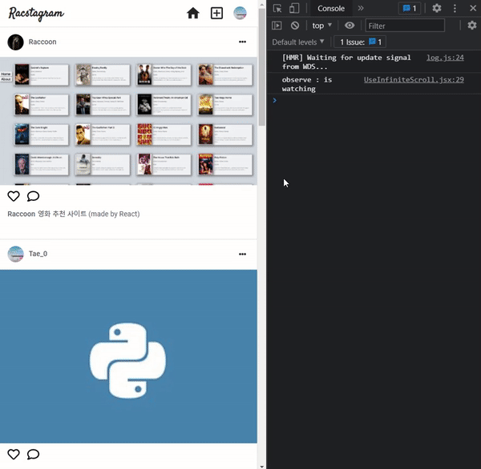

> # 리팩토링 Instagram 클론 프로젝트 by Redux-toolkit34

<br/>

<p align="center">

</p>

<br/>

> # 📄 프로젝트 안내

해당 프로젝트에 관한 자세한 화면 개요 및 스타일, 상태 관리, 코드에 관한 사항은 [Github : RaccoonCode96/redux_racstagram ](https://github.com/RaccoonCode96/redux_racstagram)을 확인해 주세요.

<br/>
<br/>
<br/>

> # 📅 TIL (Today I Learned, 오늘 깨달은 것들)

<br/>

# 2021.08.19 사항

<br/>

전에 발생했던 무한 스크롤 데이터 끝 처리 버그를 해결하기 위한 접근과 제가 해결한 과정을 나누어 보고자 합니다. Intersection Observer에 대해서 잘 모르시면, 잘 정리된 [intersection-observer by HEROPY TECH](https://heropy.blog/2019/10/27/intersection-observer/) 글을 봐주시면 좋겠습니다.

<br/>

## 1. 무한 스크롤 개선

<br/>

<p align="center">

</p>

<br/>
<br/>

> ### 기존 무한 스크롤의 무한 스크롤 데이터 끝 처리 버그의 발생 이유

<br/>

무한 스크롤 데이터 끝 처리 버그를 설명하자면, 데이터 요청 후 더이상 불러올 데이터가 없음에도 불구하고 데이터를 요청을 하여 마지막에 불러온 데이터를 또 불러와 기존에 있던 Array에 넣어 붙임으로서 글이 복사되어 보이는 버그 입니다.

<br/>

이는 기존에 Intersection Observer을 활용한 무한 스크롤을 깊은 test 없이 구현하여 발생한 문제입니다. Intersecting이 되어 데이터를 요청 후 데이터가 없는 경우 이에 대한 피드백으로 Observer를 막거나, 어떤 조치를 취하지 않을 뿐더러 근본적으로 lifecycle을 제대로 설정해 두지 않아서 발생한 문제 였습니다.

<br/>

> ### 변경 전 UseInfinteScroll

<br/>

예전에 구현한 UseInfinteScroll에 대해서 간단히 설명하자면, UseInfiniteScroll을 컴포넌트화 시켜 Observer가 감지하는 target인 마지막 element를 자체적으로 가지고 있게 하였습니다.

외부적으로 UseInfinteScroll을 표시하는 상위 컴포넌트에서 여러 조건을 걸어서 UseInfiniteScroll을 강제로 unmount 시켜 disconnect 시킬 수 있습니다. (부모 상황에 따라서 observe를 제어할 수 있습니다.)

또한, 상위 컴포넌트에서 observer가 실행시킬 함수를 UseInfiniteScroll 컴포넌트의 excute prop으로 전달하여 유동적으로 실행할 함수를 설정 할수 있습니다.

<br/>
<br/>

하지만, 현재 상황에서는 execute에 들어올 데이터를 더 요청하는 함수(getMorePosts)는 내부적으로 변경될 여지가 있습니다. **예전에 구현한 UseInfinteScroll의 observer는 변경되는 함수를 반영하지 못합니다.**

기본적으로 IntersectionObserver의 객체는 생성할 때 부터 실행할 함수를 받아 생성되어 집니다. 그러므로 실행할 함수를 변경하는 것은 불가능 하여 실행 함수를 변경하려면, 새로운 IntersectionObserver 객체를 생성하여 다시 지정해야 합니다.

만약, 함수가 변경될 필요가 없는 상황이라면 아래와 같이 observer를 컴포넌트 단에서 지정하고 useEffect를 통해서 observer의 상태를 변경해주면 됩니다.

**저의 경우에는 유동적으로 계속해서 execute에 들어오는 함수가 내부적으로 변경되어 반영되어야할 필요가 있어 아래와 같은 상황은 적절하지 않았습니다.**

<br/>

```js
// 현재 상황에서 잘못된 구현 방식
import { debounce } from "lodash";
import React, { useRef, useEffect, useMemo } from "react";

const UseInfiniteScroll = ({ execute }) => {
  const debounceExecute = useMemo(() => debounce(execute, 300), [execute]);
  const lastElRef = useRef(null);
  const observer = new IntersectionObserver(
    ([{ isIntersecting }]) => {
      if (isIntersecting) {
        console.log("function run");
        debounceExecute();
      }
    },
    { threshold: 0.5 }
  );

  useEffect(() => {
    observer.observe(lastElRef.current);
    console.log("observe : is watching");
  }, []);

  useEffect(() => {
    return () => {
      observer.disconnect();
      console.log("observe : disconnected");
    };
  }, []);

  return <div ref={lastElRef} style={{ height: "20px" }}></div>;
};

export default UseInfiniteScroll;
```

<br/>
<br/>
<br/>

> ### 변경 후 UseInfinteScroll

<br/>

예전과 다르게, observer가 계속해서 새로 만들어져야 한다는 것을 깨닫고 컴포넌트 내부에서는 useRef를 활용해서 미리 observer 식별자를 지정해 두고 prop으로 들어오는 excute의 내부적 변화를 감지하여 observer.current에 변경된 excute 함수를 가진 새로운 IntersectionObaserver 객체를 할당 하여 반영하도록 하였다.

<br/>

**여기저 주의할 점은 observe가 된상태에서 같은 식별자에 새로운 observer 객체를 할당한다고 해도 observe된 객체는 가비지 컬렉터에 의해서 사라지지 않는듯 했습니다.** 그래서 새로운 객체를 할당하기 전에 excute 함수에 변화가 감지되면 기존에 할당시킨 식별자에 observer를 disconnect해주어야 합니다.

<br/>

```js
import { debounce } from "lodash";
import React, { useRef, useEffect, useMemo } from "react";

const UseInfiniteScroll = ({ execute }) => {
  const debounceExecute = useMemo(() => debounce(execute, 300), [execute]);
  const lastElRef = useRef(null);
  const observer = useRef(null);

  useEffect(() => {
    // 식별자에 있는 기존 observe를 제거하여 초기화합니다.
    if (observer.current) {
      observer.current.disconnect();
      console.log("observe: init");
    }

    // debounceExecute 함수가 변경될 때마다 변경된 debouceExecute를 반영한 IntersectionObserver 객체를 재할당 하고, observe를 실행합니다.
    observer.current = new IntersectionObserver(
      ([{ isIntersecting }]) => {
        if (isIntersecting) {
          debounceExecute();
          console.log("function run");
        }
      },
      { threshold: 0.5 }
    );

    observer.current.observe(lastElRef.current);
    console.log("observe : is watching");
  }, [debounceExecute]);

  // 외부 컴포넌트에 의해 unmount 되면, observe를 disconnect 하여 제거합니다.
  useEffect(() => {
    return () => {
      observer.current.disconnect();
      console.log("observe : disconnected");
    };
  }, []);

  return <div ref={lastElRef} style={{ height: "20px" }}></div>;
};

export default UseInfiniteScroll;
```

<br/>

> ### 데이터 끝 처리

<br/>

데이터를 요청하고 데이터가 없는 경우 데이터가 없음을 표시하는 redux state를 만들고 이를 부모 컴포넌트에서 UseInfinteScroll의 unmount 조건으로 걸어 두어 데이터가 끝나면 unmount 시켜 더 이상 observer가 실행되지 않게 합니다.

<br/>

```js
return (
  <>
    {!isNone && <UseInfiniteScroll execute={getMorePosts} />}
    {isNone && "더 이상 글이 없습니다."}
  </>
);
```

<br/>
<br/>
<br/>
