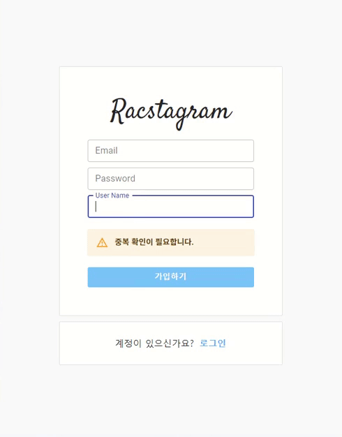

> # 리팩토링 Instagram 클론 프로젝트 by Redux-toolkit36

<br/>

<p align="center">

</p>

<br/>

> # 📄 프로젝트 안내

<br/>

해당 프로젝트에 관한 자세한 화면 개요 및 스타일, 상태 관리, 코드에 관한 사항은 [Github : RaccoonCode96/redux_racstagram ](https://github.com/RaccoonCode96/redux_racstagram)을 확인해 주세요.

<br/>
<br/>
<br/>

> # 📅 TIL (Today I Learned, 오늘 깨달은 것들)

<br/>

# 2021.08.23 사항

<br/>

## Material UI TextField 컴포넌트 도입을 통한 유효성 검사(Validation Check) 및 피드백

<br/>

오늘은 사용자의 input을 받는 경우 유효성 검사를 실시하여 submit을 제한하고, 형식에 맞는 값을 넣도록 안내(피드백)하도록 알림을 보여 줄수 있도록 하고자 하였습니다.

<br/>

> ### 과거 구현 방식

<br/>

기존에 input의 경우에는 input을 submit을 누르는 경우 confirm 창을 띄워서 사용자에게 안내했습니다. 이렇게 confirm 창으로 알려주게 되면 사용자가 input을 입력 후에 submit을 계속 눌러서 현재 상황에 대한 안내를 받게 됨으로 사용하는데 불편하다고 생각했습니다.

- 사용자는 submit을 누르고 confirm 모달 창 안내를 확인한 후 확인을 눌러야 함으로서 계속 2번의 클릭이 필요하게 됩니다.
- 사용자가 input을 작성하면서 input 값에 대한 안내를 바로 화면에서 볼 수 있도록 하고자 합니다.
- 예전에 구현했던 자동 input 중복 체크를 통한 안내(피드백) 구현과 비슷합니다.

<br/>

이렇게 화면에 바로 안내메세지를 보여주는 방식은 상태 메세지를 input 하단에 나타나게 구현할 수 있습니다. 기존에 submit에 대한 반응 처럼(예.로그인 실패) 하나의 영역에 모든 안내(피드백) 메세지를 보이도록 구현했었습니다.

- 예시) 기존: 동일한 영역에서 피드백 제공 형식

<p align="center">

</p>

<br/>
<br/>
<br/>

> ### 현재 구현 방식

<br/>

기존의 동일한 영역에서 피드백을 제공하는게 아닌 각 input에 해당하는 부분에서 해당 피드백을 제공하는게 더 좋을 것 같다고 생각했고, 해당 형식에 맞지 않으면 submit 자체를 disabled 처리하여 접근하지 못하게 막음으로서 안전성을 높이고자 하였습니다.

위에서 말한 것과 같이 각 input 영역에 피드백을 제공하기 위해서, 저는 Material UI TextField의 helperText를 활용하는 것으로 접근하였습니다.

Material UI의 TextField는 자체적으로 Validation에 대한 error 표시를 쉽게 구현할 수 있도록 만들어져 있습니다.

<br/>

하지만, 현재 상황에서는 단지 error만 표시하는게 아닌 여러가지 상태의 안내를 구현하고자 했습니다. 그렇기 때문에 TextField 컴포넌트의 스타일을 커스텀 해줄 필요가 있었습니다.

- 오리지날 TextField 컴포넌트는 단순히 error에 대한 피드백은 빨간색으로만 나타냅니다.
- 값이 비거나, 형식에 안맞거나, 형식에 맞는 등의 피드백을 보여주기 위해 다양한 색깔을 TextField 컴포넌트에 주기 위해서는 커스텀이 필요합니다.

<br/>
<br/>
<br/>

> ### TextField 커스텀 스타일 지정하기

<br/>

Material UI의 TextField의 경우 다양한 방식으로 커스텀 스타일을 지정할 수 있습니다. 정말 많은 방식이 존재하기 때문에 어떤 것을 해야할지 난감했습니다.
TextField 컴포넌트도 완전히 input 요소 기반이 아닌 내부적으로 다른 요소들도 포함 되어 있어서 내부 요소로 접근하여 스타일을 변경해야 하는 등 복잡하였습니다. (해당 방법을 찾는데 많은 시간이 걸렸습니다.)

<br/>

<p align="center">

</p>

공식 사이트에 나와있는 방식 중에서, TextField의 InputProps, FormHelperTextProps로 접근하여 makeStyles hook (Material UI에서 제공하는 hook)을 활용하여 className에 값을 지정해주는 방식을 채택하였습니다.

- [material-ui : customized-inputs](https://material-ui.com/components/text-fields/#customized-inputs)
- 현재 구현하려고 하는 스타일은 동적으로 스타일을 변경해 주어야 하는 작업이며, 재사용성을 높이고자 해당 방식을 채택하였습니다.
- 다른 방식의 경우에는, 기존 TextField 컴포넌트에 지정된 스타일을 덮어 새로운 컴포넌트를 만드는 방식인 HOC 형태 입니다. (물론, 더 생각해 보면 이방식으로도 만들수 있을 것 같긴 합니다.)

```js
// useStyles에 color를 props로 넘겨서 설정된 input, helperText 스타일 객체를 얻을 수 있습니다.
import { makeStyles } from "@material-ui/core";
const useStyles = makeStyles({
  input: {
    "& input + fieldset": {
      borderColor: (props) => props.color,
    },
    "& input:valid:focus + fieldset": {
      borderColor: (props) => props.color,
    },
    "& input:valid:hover + fieldset": {
      borderColor: (props) => props.color,
    },
  },
  helperText: {
    color: (props) => props.color,
  },
});

// 스타일 객체의 해당하는 프로퍼티가 가진 스타일 값 객체를 InputProps, FormHelperTextProps에 연결시켜 적용시킬 수 있습니다.
<TextField
  type="text"
  variant="outlined"
  InputProps={{
    className: useStyle({ color: "green" }).input,
  }}
  FormHelperTextProps={{
    className: useStyle({ color: "green" }).helperText,
  }}
/>;
```

<br/>
<br/>
<br/>

> ### 유효성 체크 상태에 따른 스타일 생성 hooks (useChecks)

<br/>

이를 효율적으로 사용하기 위해서 validation에 따른 code를 통해 적절한 color, message가 연결 될 수 있도록 구현하였습니다.

```js
// useChecks js파일의 hooks 구현
import { useSelector } from "react-redux";
import { makeStyles } from "@material-ui/core";

// material UI Color TextField 스타일 객체 반환기
const useStyles = makeStyles({
  input: {
    "& input + fieldset": {
      borderColor: (props) => props.color,
    },
    "& input:valid:focus + fieldset": {
      borderColor: (props) => props.color,
    },
    "& input:valid:hover + fieldset": {
      borderColor: (props) => props.color,
    },
  },
  helperText: {
    color: (props) => props.color,
  },
});

// 패스워드 validation 확인
export const checkPassword = (password) => {
  let res = false;

  if (!password) {
    res = false;
  } else {
    const check = /^(?=.*[A-Za-z])(?=.*\d)[A-Za-z\d]{8,}$/.test(password);
    check ? (res = true) : (res = false);
  }

  return res;
};

// Email validation 확인
export const checkEmail = (email) => {
  let res = false;

  if (!email) {
    res = false;
  } else {
    const check =
      /^[0-9a-zA-Z]([-_.]?[0-9a-zA-Z])*@[0-9a-zA-Z]([-_.]?[0-9a-zA-Z])*.[a-zA-Z]{2,3}$/.test(
        email
      );
    check ? (res = true) : (res = false);
  }

  return res;
};

// website 형식에 대한 피드백 message, color 반환기
export const useCheckWebsite = (website) => {
  let color = "";
  let message = "";
  let code = "";
  const res =
    /https?:\/\/(www\.)?[-a-zA-Z0-9@:%._+~#=]{1,256}\.[a-zA-Z0-9()]{1,6}\b([-a-zA-Z0-9()@:%_+.~#?&//=]*)/.test(
      website
    );
  if (!website) {
    color = "rgba(0, 0, 0, 0.3)";
    message = "";
    code = "empty";
  } else {
    if (res) {
      color = "green";
      message = "URL 형식에 맞습니다.";
      code = "success";
    } else {
      color = "red";
      message =
        "URL 형식에 맞지 않습니다. (http:// 또는 https://를 포함시켜주세요.)";
      code = "error";
    }
  }

  return {
    input: useStyles({ color }).input,
    helperText: useStyles({ color }).helperText,
    helperTextMessage: message,
    code,
  };
};

// userDisplayName 중복 검사 결과에 대한 피드백 message, color 반환기
export const useCheckDisplayName = (prevDisplayName, displayName) => {
  const exist = useSelector((state) => state.users.checkDisplayName.exist);

  let code = "";
  let color = "";
  let message = "";

  // 유효성 검사에 따른 code 할당부
  if (prevDisplayName === displayName) {
    code = "default";
  } else {
    if (!displayName) {
      code = "empty";
    } else if (!exist[1] || displayName !== exist[1]) {
      //이름이 확인된 적이 없는 경우 또는 이전에 확인된 이름과 input이 같지 않은 경우
      code = "warning";
    } else {
      // 확인된 이름이 존재하는 경우
      if (exist[0]) {
        code = "error";
      } else {
        // 확인된 이름이 존재하지 않는 경우
        code = "success";
      }
    }
  }

  // 할당된 코드에 따른 color, message 할당부
  switch (code) {
    case "empty":
      color = "orange";
      message = "이름을 입력해 주세요";
      break;
    case "warning":
      color = "orange";
      message = "중복 확인이 필요합니다.";
      break;
    case "success":
      color = "green";
      message = `${exist[1]}는 사용가능 합니다.`;
      break;
    case "error":
      color = "red";
      message = `${exist[1]}는 이미 존재하는 이름입니다.`;
      break;
    default:
      color = "rgba(0, 0, 0, 0.3)";
      message = ``;
  }
  return {
    input: useStyles({ color }).input,
    helperText: useStyles({ color }).helperText,
    helperTextMessage: message,
    code,
  };
};
```

<br/>

- 이름 중복 체크 피드백, 웹사이트 형식 체크 피드백

<br/>

<p align="center">

</p>

<br/>
<br/>
<br/>

# 2021.08.24 사항

<br/>

## 유효성 체크에 따른 submit 버튼 disabled 처리

<br/>

오늘은 validation 충족시 submit 버튼이 누를수 있는 상태로 변경될 수 있게 하였습니다.

<br/>

기존에는 validation 확인도 안한 상태로 언제든지 사용자가 submit을 누를수 있었습니다. 그래서 validation 자체를 submit이 실행될 때 체크하여 알림창을 띄우는 형태 였습니다.

- 사용자 입장에서는 매번 submit을 눌러서 피드백을 받아야 하는 입장이므로 불편합니다.
- 개발자 입장에서는 submit이 validation 관한 로직으로 가득차서 복잡해 집니다.

<br/>

> ### 실제 인스타그램의 유효성 처리

<br/>

이러한 문제점을 생각하고, 실제 인스타그램에서는 어떻게 로그인 등의 Validation이 어떻게 처리되는지 확인했습니다.

<br/>

**인스타그램에서는 자체적으로 submit 버튼을 형식에 맞지 않으면 diabled로 누르지 못하게 사용자의 접근을 막아 사용자에게 validation 피드백을 주고있었습니다.**

<br/>

- 실제 인스타그램의 submit 버튼 disabled

<p align="center">

</p>

<br/>

예전에 댓글 submit 버튼을 구현할 때 이런식으로 구현했었는데 이번에도 그러한 형식으로 여러 submit 버튼을 validation을 넣어 diabled 구현을 하였습니다.

<br/>

> ### disabled 로직 작성하기

<br/>

submit을 할 유효성 검사 조건이 모두 충족되는 경우 submit 버튼 disabled를 false로 처리해 주고 나머지는 true로 하여 사용자의 접근을 막습니다.

<br/>

<p align="center">

</p>

이를 위해서는 disabled 값을 판단 해줘야 하는 함수가 필요합니다. 저는 checkDisabled 함수를 지정하여 해당 함수를 submit 버튼의 disabled 프로퍼티에 바로 연결시켜 반영된 값을 계속해서 받을 수 있도록 하였습니다.

<br/>

그리고, CSS로 disabled 상태일 경우의 스타일을 추가해 줍니다. (저는 버튼 색상을 gray로 하고 pointer가 안보이게 스타일을 지정하였습니다.)

```js
const ExampleComponent = () => {
  // checkDisplayName 객체, checkWebsiteRef 객체 생략

  // 상태 code 값으로 disable로 지정할 값(true or false) 반환해줌
  const checkDisable = () => {
    if (
      !(
        checkDisplayName.code === "success" ||
        checkDisplayName.code === "default"
      )
    ) {
      // (dispalyName이 이전과 같거나, 중복 체크에서 성공한 경우)가 아닌 경우 -> disable true (버튼 비활성화)
      return true;
    } else if (checkDisplayName.code === "empty") {
      // dispalyName이 빈 값인 경우 -> -> disable true (버튼 비활성화)
      return true;
    } else if (
      // (website가 빈 값이거나, 형식검사에서 성공한 경우)가 아닌 경우 -> disable true (버튼 비활성화)
      !(checkWebsiteRef.code === "empty" || checkWebsiteRef.code === "success")
    ) {
      return true;
    } else {
      return false;
    }
  };

  return (
    <Button
      variant="contained"
      className="update_btn"
      color="primary"
      type="submit"
      disableElevation
      disabled={checkDisable()}
    >
      수정
    </Button>
  );
};
```
