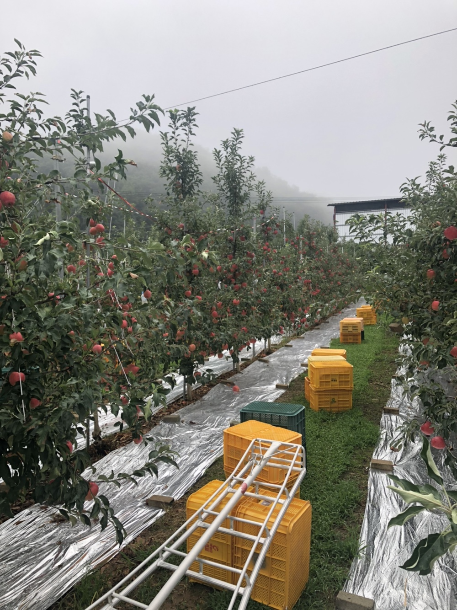

> # 리팩토링 Instagram 클론 프로젝트 by Redux-toolkit37

 

 

> # 📄 프로젝트 안내

 

해당 프로젝트에 관한 자세한 화면 개요 및 스타일, 상태 관리, 코드에 관한 사항은 [Github : RaccoonCode96/redux_racstagram ](https://github.com/RaccoonCode96/redux_racstagram)을 확인해 주세요.

 
 
 

> # 📅 TIL (Today I Learned, 오늘 깨달은 것들)

 

자주 올라오던 포스팅이 최근에 몇 일간 올라오지 않았는데요. 25일 ~ 30일 까지 아버지 사과 과수원 수확을 도와드리느라 한동안 포스팅을 못했습니다.

당연히, 프로젝트 작업은 못했고 간간히 프로젝트 이슈들만 생각해보는 정도만 한 것 같습니다.

 

 

# 2021.08.25 ~ 30 사항

 

## 좋아요 기능 구현에 있어서 딜레마

 

저번에 좋아요 기능을 구현했었습니다. 그런데 다른 작업을 하면서 좋아요 기능을 모두다 구현한게 아니라는 것을 깨달았습니다.

예전에 구현한 좋아요의 경우 db에서 post 내부가 아니라 따로 like를 관리합니다. 그때 좋아요를 구현할때 해당 post와 like 정보가 짝을 맞추어 화면에 표시하는게 중요했었습니다.

 

> ### 문제인식

 

프로젝트 특성상 post는 각 페이지에 필요한 posts를 가져와야 합니다. posts를 해당 페이지 특성에 맞게 getAllPosts, getCurrentUserPosts, getUserPosts 3가지 형식으로 요청함수를 제작하고 redux state도 3개로 구분하여 관리하기 때문에 like 요청도 이를 맞추어 제작해야한다는 것입니다.
또한 무한 스크롤 기능이 추가되었기 때문에 getMorePosts처럼 getMoreLikes도 구현해야합니다.

- post 관련 요청 함수
  - getAllPosts : 시간순으로 모든 유저의 글을 요청함 (6개) -> Home page
  - getCurrentUserPosts : 현재 유저의 글만을 요청함 (6개) -> Profile page
  - getUserPosts : 특정 유저의 글만을 요청함 (6개) -> userProfile page
  - getMorePosts : 무한스크롤 기능으로 각 post 형식에 따라 마지막 데이터 다음에 있는 데이터를 가져와 해당 redux state에 추가함 (6개)
- post 관련 redux state
  - allPosts, currentUserPosts, userPosts
- 예전에 구현한 like
  - **getLikes : getAllPosts에 해당하는 likes로 무한스크롤이 반영되지 않아 특정 개수 없이 모든 자료를 가져오게 됩니다.**

 

**이전에는 getAllPosts에 대한 likes만 구현했고 무한스크롤도 반영하지 않아서 한번에 전체 likes를 가져오기 떄문에 돌아는 가지만 효율적이지 못했습니다.**

 

위와 같은 상황때문에 post와 맞게 like를 구현하려면, getAllLikes, getCurrentUserLikes, getUserLikes, getMoreLikes 이렇게 4개를 구현해야 합니다. 4개씩이나 거이 비슷하게 구현해야 한다고 생각하니 뭔가 보일러 플레이트 코드같고, 좀더 효율적인 코드를 작성하고 싶다는 생각을 했습니다.

 

동시에, db에서 likes와 post를 따로 관리하도록 판단한 것이 과연 옳았을 까라는 생각이 들기도 하였으며 분리 하지 말껄이라는 후회도 있었습니다.

 
 
 

> ### 고찰

 

### 생각 1) like관련 데이터를 post db 내부에서 관리하기 (통합 관리)

통합 관리로 하면, post 데이터와 한꺼번에 가져올 수 있어 굳이 like 요청 함수를 만들 필요가 없게 됩니다.

하지만, like 기능상으로 좋아요를 누르사람의 uid가 모두 들어가게 됨으로서 like의 자료가 엄청나게 커질 수 있기 때문에 post의 데이터 크기에 부담을 주는 것은 변하지 않는다고 생각했습니다.

또한, like의 변화를 반영하게 되면, 나머지 like와 관련없는 post의 데이터도 재 렌더링 될것으로 예상 됩니다.

 
 
 

### 생각 2) 각 postId에 맞는 like 데이터를 각각의 post 마다 server에 요청하기

db의 데이터 요청은 redux의 state로 받기 때문에 각 post에 맞는 like데이터를 담을 state 하나 하나를 만들어야 함으로 너무 많은 state를 만들게 될 것임으로 비효율적인 방법인 것 같습니다.

그러므로, like 데이터는 배열 형태의 1개의 state로 담아와야 할 것 같습니다.

 
 
 

### 생각 3) getMorePosts 요청 함수의 통합

위의 생각들을 조합해 보면, db분리 관리와 1개의 state 사용은 불가피 한것으로 판단됩니다.

그러면, 기존의 getMorePosts 함수를 getAllLikes, getCurrentUserLikes, getUserLikes에 각각 포함되도록 하여 getMorePosts 함수를 제거하여 해보는 것은 어떤가 생각해 보았습니다.

**4개의 함수 구현에서 1개만 줄여 3개로 만들어도 총 6개이므로 그나마 효율적으로 함수를 만들수 있다고 생각되어 시도해볼 생각입니다.**
