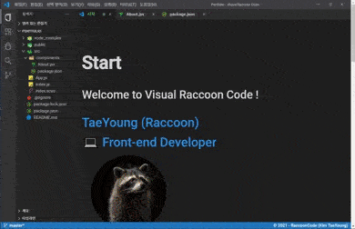

> # 💼 나만의 포트폴리오 만들기

<br/>

<p align="center">

</p>

<br/>

<P>
요즘에는 취업 준비를 위해서 포트폴리오를 만들고, 이력서를 작성하는데 시간을 보내고 있습니다. 예전에 문제 해결을 위해서 여러 블로그 글을 돌아다니다가, 맥 OS 스타일의 개발 블로그 페이지를 보았습니다.
</p>

- [찬미니즘](https://c17an.netlify.app/)

정말 잘 만들었더라구요, 그래서 저도 저만의 스타일로 포트폴리오를 만들고 싶었습니다. 그래서 생각한 것이 개발자가 항상 보는 에디터인 vscode의 스타일로 포트폴리오를 만들면 재미있겠다라는 생각이 들어서 만들게 되었습니다.

- [VRCode 포트폴리오 github](https://github.com/RaccoonCode96/vrcode)

<br/>
<br/>
<br/>

## 📝 기획

일단, 여러 개발자들이 만든 포트폴리오를 구글에서 찾아보았습니다. 대부분의 경우에는 1개의 page로 구성된 스크롤 스타일로 만들어져 있었습니다.

그 중에서 해당 목차를 눌러서 해당 제목(title) 위치로 스크롤이 이동되는 형식이 맘에 들어 포트폴리오 프로젝트에서 구현해보기로 목표를 제일 처음 잡았습니다.

Visual Studio Code를 모티브 하므로, Visual Raccoon Code로 프로젝트 제목을 정하였습니다.

<br/>

> ### VSCode 스타일 확인하기

<br/>

VSCode의 경우 최상단 title bar, 좌측 Navigation의 이동 bar, Main 으로 크게 나뉘며, page에 따라서 좌측 Navigation bar에 대한 side bar?(tab)가 변하는 형태였습니다. 그리고 title bar 바로 아래에는 작업 창을 나타내는 tabs 가 존재했습니다.

- title bar : vscode 아이콘, (파일, 편집, 선택영역 ... 등)의 버튼, title, 창 최소화, 최대화, 닫기 버튼
- Tabs : 열려있는 작업 창들을 표현하는 tab들이 들어있는 tabs
  - Tab: 각 탭 마다, 파일 아이콘 + 파일 이름 + x 버튼
- side Navigation : 탐색기, 검색, git, 디버그, 확장 아이콘
- side bar : Navigation을 클릭한 경로에 따른 side 영역
  - 탐색기: 파일 및 폴더 등의 디렉 구조를 표현함
  - 검색 : 검색, 바꾸기 input이 있으며 검색시, 해당 결과가 나타남
  - git : git을 통해서 변경이 발생한 파일들의 목록이 나타남
  - 디버그: 디버그 실행 버튼들이 있음
  - 확장: 확장 서비스들의 아이콘, 제목, 설명등의 row가 보여짐
- main: 해당 Navigation 경로에 따른 활성화된 tab의 content를 표현하는 영역
- footer : 브렌치 표시, 여러 확장 프로그램에 대한 상태 표시

위 처럼 VSCode의 UI는 굉장히 많고, 그에 따른 표현되는 요소가 많다 보니, 단일 페이지 속성의 스크롤 만으로는 표현 되는 UI 요소가 너무 낭비인 것 같다는 생각이 들었습니다. 그래서 최대한 그런 요소들을 잘 활용해 보고 재미있게 만들기로 계획 했습니다.

<br/>

> ### VRCode 표현 계획

<br/>

- title bar: header로 이름을 잡고, vscode icon과 편집 버튼들, 최대화, 최소화 등의 버튼들은 기능 없이 표현만 하고 title을 프로젝트 이름을 사용하도록 하였습니다.
- Tabs : Tabs로 이름을 잡고, 내부적으로 Tab들이 존재하고, 현재 페이지에 대한 간접적인 목차 nav 형태로 만들고자 했습니다.
- Side Navigation: Navigation으로 이름을 잡고, Intro(탐색기), Contact(검색), github(git), study(디버그), project(확장) 해당 페이지(Route)와 연결 될 수 있도록 구상하였습니다.
- Side bar: Side bar로 이름을 잡고, Navigation 상황에 맞는 이스터 에그 스러운 표현들을 해보도록 계획 했습니다.
  - Intro의 side bar는 Component 폴더에서 tabs와 같은 목차 제공
  - Contact의 side bar는 회사와 동료들을 찾고 있다는 표현
  - study의 side bar는 study 영역에 맞는 버튼 기능을 표현
  - Project의 side bar는 각 프로젝트를 extension 처럼 표현
  - github의 경우 해당 github 페이지 연결
- mains : 각 Navigation에 맞는 main들을 표현
  - intro의 main 경우 start, about, stacks에 대한 main들을 표현
  - contact의 경우 contact에 대한 main 만을 표현
  - study의 경우 study에 대한 main 만을 표현
  - project의 경우 project에 대한 main만을 표현
    - 각 프로젝트를 클릭하는 경우 main을 project detail로 바꾸어 표현될 수 있게 하고자 함
  - github의 경우 route가 없고 단지 github를 새탭으로 띄워주는 역할만 함
- footer : 말 그대로 footer로 master branch임을 보여주고, copy right를 작성하고자 함

<br/>
<br/>
<br/>

## 💻 구현 사항

<br/>

계획한 대로 화면을 구현하였고, 넣고 싶은 기능들이 구현하는 과정에서 몇가지 생겨 넣었습니다.

- `목차 기능` : tabs의 tab을 누르면, 해당 title의 위치로 스크롤이 이동

  - 생각보다 간단한 기능으로, 단지 원하는 titile 요소에 id를 주어서 a 태그에 해당 id를 href로 주면 a 태그 클릭시 해당 요소로 스크롤이 이동하게 됩니다.

<br/>

- `검색 기능`: project route의 경우 side bar로 특정 project들을 extension 스타일로 결과를 볼수 있도록 검색 input을 만들었습니다.
  - 원했던 검색은 자동 완성 검색과 비슷하게 중간 중간 input에 넣은 값을 부분적으로 만족하는 경우도 검색 결과에 타나 날수 있도록 하고자 하였습니다.
  - 그래서, input과 검색 target들의 문자열을 하나하나 비교하는 로직으로 구성하였습니다. 원하는 검색은 input의 해당 문자열과, 순서가 맞으면 검색이 되게 하는 것으로 db의 많은 데이터가 아니라 몇개 안됨으로 아래와 같이 코드를 작성하여 구현하였습니다.

```js
// 부분 일치 검색 함수
// (대소문자 상관 없이 입력된 값과 위치가 일치시 true 반환)
const check = useCallback((userInput, title) => {
  const input = userInput.trim().toLowerCase();
  const target = title.trim().toLowerCase();
  let res = true;
  // input이 없는 경우 모든 결과가 보이게 함
  if (!input) {
    return res;
  }
  // input이 있는 경우 같은 index의 input의 문자열과 target의 문자열 비교, 한번이라도 다른 경우 false 반환
  for (let i = 0; i < input.length; i++) {
    if (input[i] !== target[i]) {
      res = false;
      break;
    }
  }
  return res;
}, []);
```

<br/>

- `생략된 글 더 보기 기능` : instagram에서 구현해보았던 기능으로, 애초에 들온 값을 slice를 통해 제한하여 원래 값과 변화한 값을 두개를 가지고 표시 상태를 변경하여 보여주는 형식으로 구현하였습니다.
  - 저는 깔끔하게 하기 위해 더 보기가 ON인 경우 더보기 버튼이 사라지게 하였습니다. 상황에 맞게 더보기/ 더 안보기로 만들어도 상관은 없습니다.

```js
const TestComponent = ({ desc }) => {
  const [isMore, setIsMore] = useState(false);
  const smallDesc = useMemo(() => desc && desc.slice(0, 19), [desc]);
  return (
    <p>
      {isMore ? desc : smallDesc}
      {!isMore && (
        <span
          className="study_desc_more"
          onClick={() => {
            setIsMore(!isMore);
          }}
        >
          ...더 보기
        </span>
      )}
    </p>
  );
};
```

<br/>

- `클립보드 복사 기능` : 이메일, 전화번호 클릭시 이메일 또는 전화번호가 클립보드로 바로 복사되게 하는 기능을 구현했습니다. (Contact Route에서 유용)
  - 현재 브라우저의 기능들이 강해지면서 제공하고 있는 API들이 늘어나고 있습니다. 저는 그 중 `navigator.clipboard API`를 사용했습니다.
  - clipboard API의 `writeText()`를 사용하면 손쉽게 사용자가 복사할 수 있게 할 수 있습니다.
  - 또한, Antdesign의 nofication component를 사용하여 정상적으로 복사가 되었다는 알림을 보일 수 있게 하면 더욱 효과적입니다.
  - 환경에 따라서 clipboard를 제공하지 않는 경우도 있어서, 에러 방지 코드를 추가했습니다. (locallhost의 주소로 safari 실행시 문제가 되어 추가해습니다. 하지만, 배포 후 safari에서도 잘 동작함을 확인했습니다.)

```js
import { notification } from "antd";

const TestComponent = () => {
  const getCopy = (type, value) => {
    if (navigator.clipboard === undefined) {
      //(locallhost의 경우 모바일에서 undefined로 clipboard가 나타나서 작성하게 되었습니다.)
      openNotification("", "모바일 환경은 아직 개발중입니다.");
    } else {
      navigator.clipboard
        .writeText(value)
        .then(() => {
          openNotification(type, value);
        })
        // 혹시 모를 error 방지
        .catch(() => {
          openNotification("", "모바일 환경은 아직 개발중입니다.");
        });
    }
  };

  // antd의 notification 컴포넌트 활용
  const openNotification = (type, value) => {
    const args = {
      message: type ? `📌 ${type} 복사되었습니다.` : `❌ 복사에 실패 했습니다.`,
      description: `${value}`,
      duration: 2,
    };
    notification.open(args);
  };

  return (
    <>
      <div
        onClick={() => {
          getCopy("이메일이", "어쩌구저쩌구@naver.com");
        }}
      >
        이메일 복사하기
      </div>
      <div
        onClick={() => {
          getCopy("전화번호가", "010-1111-2222");
        }}
      >
        전화번호 복사하기
      </div>
    </>
  );
};
```

<br/>

## 배포

배포의 경우 CRA로 build 시키고 gh-pages를 활용하여 간단하게 하였습니다.

<br/>

## 기타

### gif에 대한 생각

<br/>

이번 프로젝트의 경우 사용되는 img가 굉장히 많았습니다, gif도 존재하고 생각보다 gif가 mp4 파일 보다 오히려 더 높은 파일 사이즈를 가지게 되는 경우가 많은 것 같습니다. 나름 optimize를 해도 효과적이지는 않았습니다. 나중에는 mp4를 사용해야 될 것 같습니다.
