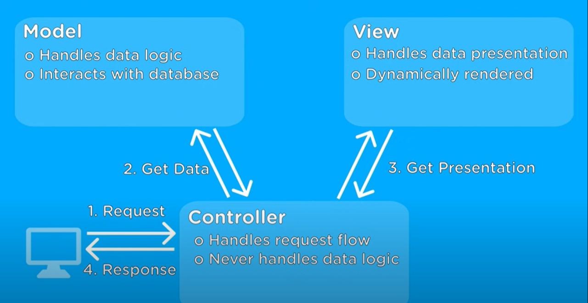

# 📝 Design Pattern

<br/>

면접을 갔다가, 코드 리팩토링에 대해서 이야기 하던 중 디자인 패턴을 알면 도움이 많이 된다는 이야기를 나눠서 공부해 보려고 합니다. 공부한 내용과 생각을 적고 있습니다.

**정확한 자료는 아닐수 있으니 맹신하지 마시길 바랍니다. 항상 다른 자료와 교차 검증을 통해 참고해 주세요.**

<br/>
<br/>
<br/>

> ## 디자인 패턴

<br/>

건축의 공법에서 착안하여 목적에 따른 효율적인 코드 작성법을 위한 소프트웨어의 개발 방법(규칙, 패턴)을 공식화 하면서 시작되었습니다.

<br/>

> ## MVC 패턴 (Model View Controller)

<br/>

유지보수가 편해지는 코드 구성 방식

- [4 분 안에 MVC 설명 by Web Dev Simplified](https://www.youtube.com/watch?v=DUg2SWWK18I)

<p align="center">

</p>

<br/>

## Controller

컨트롤러는 사용자의 요청에 따라서 Model에 데이터를 의뢰하고, 데이터를 View에 반영해서 사용자에게 알려줍니다. 즉, 사용자 요청에 따른 Model, view를 유기적으로 연결하는 부분이라고 볼수 있겠습니다.

<br/>

## Model

데이터베이스에 데이터를 가져오거나 변경 또는 저장하는 부분입니다.

<br/>

## View

사용자에게 보여지는 부분을 담당하는 부분입니다.

<br/>

## 5가지 규칙

- Model은 Controller와 View에 의존하지 않아야 한다.
- View는 Model에만 의존해야 하고, Controller에는 의존하면 안된다.
- View가 Model로 부터 데이터를 받을 때는, 사용자마다 다르게 보여주어야 하는 데이터에 대해서만 받아야 한다. (UI레이아웃 + Model -> View)
- Controller는 Model과 View에 의존해도 된다.
- View가 Model로 부터 데이터를 받을 때, 반드시 Controller에서 받아야 한다.

<br/>
<br/>
<br/>

> ## 디렉토리 구조 및 사용방식으로 확인해보기 (MVC)

<br/>

추상적으로는 알겠지만, 정확히 코드로 보면서 느끼는것이 좋은 것 같아서 express에서 어떻게 사용하는지 잘알려주는 유튜브 영상을 시청하였습니다.

영상 시청전에는 Express의 generator를 통한 디렉 구조에서는 확실하게 Model, view, controller에 대한 폴더가 생성되는 구조가 아니기 때문에 MVC가 어떻게 표현되는지 와닿지는 않았습니다. 또한 express의 경우 view로 jade나 pug를 사용하지만 저는 보통 View를 React를 사용하여 client server를 운영하는 방식에 익숙 했기 때문에 더욱 코드 예시를 통해 이해하는게 좋을 듯 했습니다.

- [ExpressJS 및 NodeJS로 MVC 패턴 배우기-튜토리얼 초급 by PedroTech](https://www.youtube.com/watch?v=Cgvopu9zg8Y)
- [MVC Pattern Explained Easy | MVC Tutorial (Example in NodeJS) by PedroTech](https://www.youtube.com/watch?v=bQuBlR0T5cc)

<br/>
<br/>

### Routes, Route

- 사용자에게 요청을 받고 요청에 적절한 Controller를 반환하는 역할을 담당하는 것으로 생각됩니다.

```js
import { express } from "express";
const router = express.Router();

import { GetAllUsers } from "../controllers/User";
router.get("/all", GetAllUsers);

export { router as UserRoute };
```

<br/>
<br/>

### Controller

- Front, Back server로 CSR을 구성하는 경우에는 Back에서는 단지 변경될 데이터만 가져오게 됨으로 Controller에서 반환하는 것은 view가 아닌 Controller가 가져온 Model의 데이터가 되는 것 같습니다.
  - 이후, front 에서 데이터를 받아 화면을 구성하겠지요.

```js
import { QueryListOfUsers } from "../service/UserTable";

export const GetAllUsers = (req, res) => {
  const userList = QueryListOfUsers();
  return res.json(userList);
};
```

- Service라는 폴더를 구성한 사람도 있는데 이때 Controller에서 Service의 메서드를 활용하여 값을 가져와 연결 시키는 것을 확인했습니다.

```js
import User from "../models/User";

export const QueryListOfUsers = (condition) => {
  if (condition) {
    return User.findAll(condition).exec();
  }

  return User.findAll().exec();
};
```

- Back server로 SSR을 구성하는 경우에는 view를 반환해야하므로 Controller에서는 Model에서 가져온 데이터를 view에 주입시켜 해당 view를 render하도록 하는 것 같습니다.

<br/>
<br/>

### Model (Model & Service)

Model의 경우 아직 DB에 대해서 제대로 배우질 못해서 잘 알지는 못하지만, DB에서의 데이터를 가져올때의 로직 및 스키마가 포함된 부분인 것 같습니다.

어떤 사람들은 Model과 Service 폴더를 나누어 사용하는데 Service가 무엇을 하는 용도인지 궁금했습니다.

확인해보니 Model의 경우에는 단순 가져올 데이터의 Schema(스키마)를 구성하는 역할을 하고, Service에서 직접적인 데이터를 가져오는 로직을 작성하여 사용하는듯 했습니다.

이렇게 사용하는 하는 것은 데이터의 안정성을 지키기 위함이라고 합니다. 보통, 많이 복잡한 프로그램을 짜게 되는 경우 여러 데이터 구조가 긴밀히 연결되어 있어 하나를 변경하면, 다른 것도 변경해줘야하는 상황이 발생합니다.

- 예전에 인스타그램 프로젝트시 발생했던, 게시글 지우기시 해당 댓글 모두 지우기 같은 2가지의 변경을 하게 로직을 짰던 기억이 납니다.
- 위와 같이 긴밀하게 연결된 데이터의 경우, 하나만 잘못 처리되어도 다른 데이터에도 영향을 주어 구조를 해치게 되므로 이를 방지하기 위해 이러한 작업사항들을 모두 성공했을 때만, 실행하고 그렇지 않으면 다시 되돌리는 이러한 안전장치라고 합니다. (DB 조작에 대한 에러 처리)
- 물론, 다양한 변경 로직들을 재사용할 수도 있게 만들기 때문에 효율적인것 같기도 합니다.

<br/>
<br/>

> ## 잠시 드는 생각

<br/>

이런 생각이 잠시 들게 됩니다. 전에는 firebase를 기준으로 프로젝트를 만들다 보니 패턴 분리 없이 db조작에 관한 코드들도 redux에 한번에 기록하여 작성했었습니다.

<br/>

그때 비동기 요청 작업 코드들 자체를 backend의 service 로직에 가깝게 작성했던것 같습니다. 그러면서 클라이언트 서버에서 redux 비동기 요청자체에서 db에 대한 에러처리까지 같이 받게 되는 그러한 구조를 작성했던것 같습니다. 위에서 말한 MVC의 5규칙에 어긋나는 것은 아닌가 생각이 듭니다.

<br/>

이러한 작업들을 했던것을 상기하면서, 어디까지가 과연 프론트고 백엔드 일까라는 생각이 듭니다. 과거 전통적인 SSR이였으면 프론트는 단지 백엔드의 View를 구성하는 사람에 지나지 않지 않을 까? 라는 생각이 듭니다. 그치만 현재는 백엔드에 적절한 양의 데이터를 어느정도 요청하고, 화면에 분배하는 과정을 구현하다 보니 모든 과정이 어떻게 보면 캐싱의 한부분이 아닐까라는 생각이 듭니다.

<br/>
<br/>
<br/>

# 어떻게 공부를 진행할까?

<br/>

디자인 패턴에 대해서 몇가지 조사를 해보았습니다. 유튜브를 통해 디자인패턴을 검색해보면, 여러가지 자료들이 나오고 또한 구글도 잘 나옵니다. 하지만, 보통 JAVA 등의 언어로 설명되어 있어 이해하기가 조금 난해합니다. 그래서, nodejs로 된 예시를 가진 디자인 패턴을 통해 공부해보려고 합니다.

- 깃허브에 nodejs-design-pattern을 검색해보면, Mario Casciaro의 Nodejs. Design 패턴 책에 대한 깃허브 글을 발견했고 해당 책이 잘 정리되어 있는듯 합니다. 그래서 찾아보니 한글로 번역한 책도 있어 구매해볼 생각입니다.
  - [NodeJs 디자인 패턴 바이블](http://www.yes24.com/Product/Goods/101686866)
- 일단은, 대략적으로 알기 위해서 깃허브에서 star 23개 짜리 repo가 있어 해당 글을 보고 익혀보려고 합니다.
  - [node-design-patterns by adoi](https://github.com/adoi/node-design-patterns)
